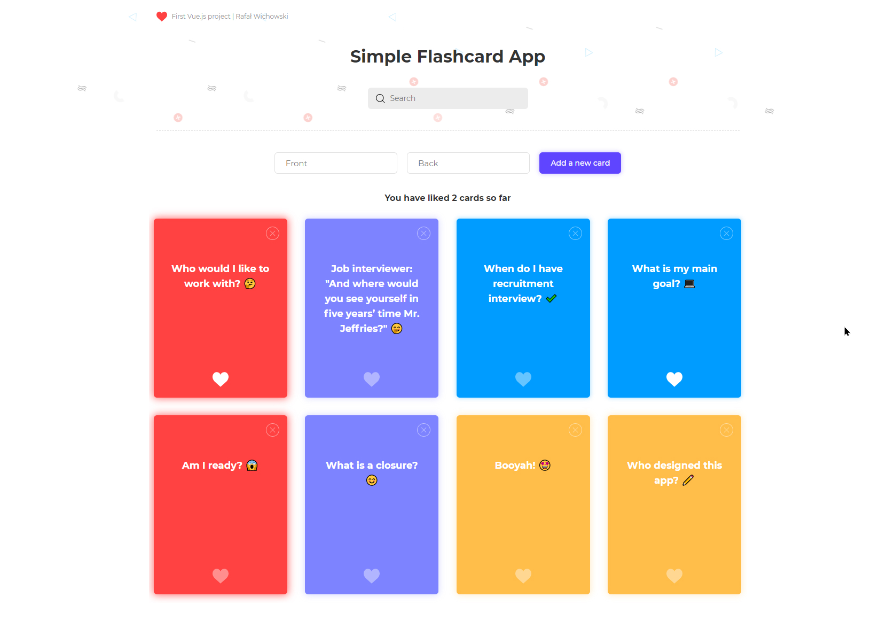

<p align="center">
  <a href="https://github.com/rawic/hangman-game">
    
  </a>

  <h3 align="center">Flashcard</h3>

  <p align="center">
    Simple Flashcard app. <a href="https://rawic.github.io/vue-flashcard-app/" target="_blank" rel="noopener noreferrer">Live</a>
    <br />
    Built with Vue.js
  </p>
</p>

## About Flashcard app

<a align="center" href="https://rawic.github.io/vue-flashcard-app/" rel="nofollow noopener noreferrer" target="blank">
  
</a>

Simple flashcard app. My very first project made with Vue.js

### Installation

```sh
yarn
yarn serve
```
### Built With

- [Vue.js](https://vuejs.org/)

## License

Distributed under the MIT License. See `LICENSE` for more information.

## Contact

Rafał Wichowski - [@rafalwichowski](https://twitter.com/rafalwichowski) - [hi@rawic.me](mailto:hi@rawic.me)

Project Link: [https://github.com/rawic/vue-flashcard-app](https://github.com/rawic/vue-flashcard-app)

[app-screenshot]: readme/app-screenshot.jpg
